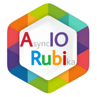

# aiorubi

  

    <em><strong>aiorubi</strong> is a modern and fully asynchronous library for <a href="https://rubika.ir/botapi">Rubika Bot API</a> written in Python 3.10+ using <a href="https://docs.python.org/3/library/asyncio.html">asyncio</a> and <a href="https://github.com/aio-libs/aiohttp">aiohttp</a>.</em>

    
    
    
    
    

---

**Documentation**: https://aiorubi.readthedocs.io

**Source Code**: https://github.com/AmirSF01/aiorubi

**Rubika channel**: [@aiorubi](https://rubika.ir/aiorubi)

---

